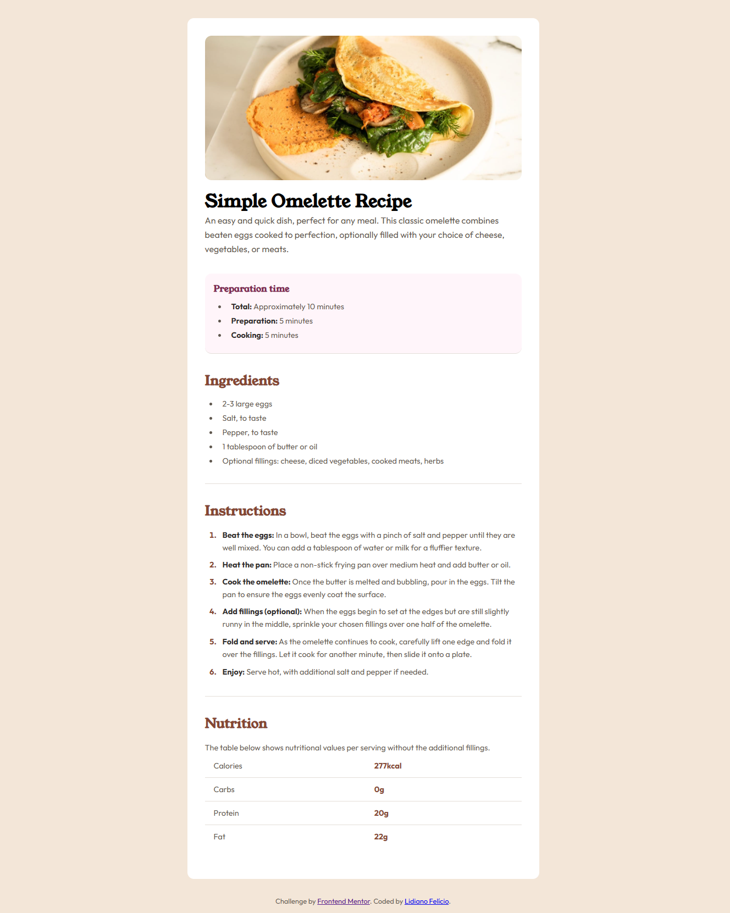

# Frontend Mentor - Recipe page

## 📸 Screenshot


This is a solution to the Recipe page challenge from  Frontend Mentor. The goal of this project was to build a responsive recipe page using semantic HTML and modern CSS techniques.

---

## 🔗 Links

* Solution URL: https://www.frontendmentor.io/profile/lidianofeliciobr
* Live Site URL: https://lihsousa.github.io/recipe-page/

---


## 🛠️ Built with

* Semantic HTML5
* CSS custom properties (variables)
* Flexbox
* Mobile-first workflow

---

## 📚 What I learned


During this project, I improved my skills in:

- Structuring HTML with semantic tags like `<section>`, `<article>` and `<header>`
- Using CSS variables for better organization and reuse
- Styling lists and pseudo-elements (like `::marker`)
- Creating responsive layouts with Flexbox and Grid
- Improving spacing and visual hierarchy

Example:

```css
.instructions li::marker {
  color: var(--text-heading);
  font-weight: 700;
}
``` 

---

 ## 🔄 Continued development

In future projects, I want to:

Improve my responsiveness skills
Practice more complex layouts
Start integrating JavaScript into my projects

---

## 👨‍💻 Author
Frontend Mentor - https://www.frontendmentor.io/profile/lidianofeliciobr
LinkedIn - https://www.linkedin.com/in/lidianofelicio/

---

## 🙌 Acknowledgments

Thanks to Frontend Mentor for providing this challenge and helping developers improve their skills.